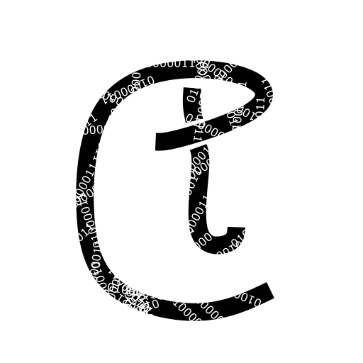

# Coditemp 
a encoder and decoder which you can use it will have a api too which you can use to encode user data in you website
## what it does

It encrypts using converting data in a weird form so that we cant understand
## currently under development
